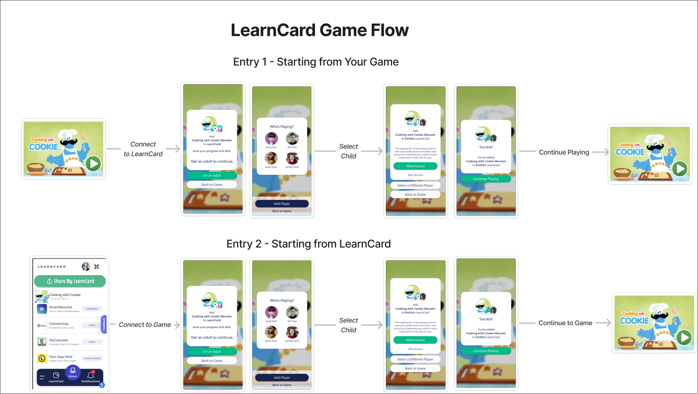

# Connect a Game


<figure><figcaption><p>GameFlow Overview</p></figcaption></figure>

## What is GameFlow?

GameFlow is an integration framework that creates a seamless connection between educational games and the LearnCard digital wallet system. At its core, GameFlow enables educational games to interact with a student's LearnCard, allowing the secure exchange of learning credentials and achievement data.

Think of GameFlow as a secure bridge between two important pieces: the LearnCard App (which stores a learner's educational accomplishments) and educational games (which create new learning experiences). When a game is connected through GameFlow, it can both read existing achievements from the student's LearnCard wallet and write new credentials as the student progresses through the game.

Since many educational games are designed for younger learners, GameFlow includes comprehensive safety features. Central to this is its built-in guardianship consent system, which ensures parents or guardians maintain oversight of how their child's educational data is used. The system leverages [ConsentFlow](broken-reference) technology to provide precise control over data ownership and privacy, giving families peace of mind about their children's digital learning journey.

By implementing GameFlow, game developers can focus on creating engaging educational experiences while knowing that all student achievement data will be securely and appropriately handled within the LearnCard ecosystem.

## Setting up GameFlow

### Overview

GameFlow builds upon [ConsentFlow](../core-concepts/consent-and-permissions/consentflow-overview.md)'s powerful contract system to manage permissions and data access in educational games. Before implementing GameFlow, we recommend familiarizing yourself with ConsentFlow's documentation to understand its contract system and management capabilities.

### Creating Your GameFlow Contract

While GameFlow contracts follow the standard [ConsentFlow](../core-concepts/consent-and-permissions/consentflow-overview.md) creation process, they require three specific configurations to enable their educational gaming features:

#### Required Configuration

**1. Guardian Consent Settings**

```javascript
needsGuardianConsent: true
```

This crucial setting activates GameFlow's child protection features. When enabled, the system will automatically guide users through a secure process where:

* An adult must first verify their presence
* The adult can then select which child is playing
* Finally, the adult reviews and grants consent for the game's data access

**2. Redirect Configuration**

```javascript
redirectUrl: "https://your-game-domain.com/callback"
```

After consent is granted, GameFlow needs to know where to send the user. The redirect URL must:

* Begin with either `http://` or `https://`
* Be prepared to receive the consenting user's DID as a query parameter: `did={consentingUsersDid}`
* Lead to an appropriate landing page in your game

**3. Access Reason (Recommended)**

```javascript
reasonForAccessing: "Your custom message here"
```

While optional, providing a clear reason helps parents understand why your game needs access to their child's LearnCard. This message appears on the consent screen and should:

* Explain the educational value
* Describe what data will be accessed or stored
* Use clear, parent-friendly language

If you don't specify a reason, the system will display a default message: "Get an adult to save your progress and skills"

## Example GameFlow Contract

```typescript
const exampleGameFlowContract = {
    name: "GameFlow Docs Contract",
    subtitle: "Example GameFlow contract for The Docs",
    description: "Look here. This is how you GameFlow contract.",
    image:
        "https://media-be.chewy.com/wp-content/uploads/2022/09/27110948/cute-dogs-hero-1024x615.jpg",
    needsGuardianConsent: true,
    redirectUrl: "https://your-website.com",
    reasonForAccessing: "Allow this game to track your achievements!",
    contract: {
        read: {
            anonymize: true,
            credentials: {
                categories: {
                    "Social Badge": { required: false },
                    Achievement: { required: true },
                },
            },
            personal: { Name: { required: false } },
        },
        write: {
            credentials: {
                categories: {
                    ID: { required: true },
                    "Learning History": { required: false },
                },
            },
            personal: { SomeCustomID: { required: true } },
        },
    },
};


const contractUri = await networkLearnCard.invoke.createContract(exampleGameFlowContract);
```

## Integrating with xAPI

### Overview

GameFlow seamlessly integrates with xAPI to track learning experiences while maintaining secure authentication through DIDs (Decentralized Identifiers). Let's explore how to implement this integration step by step.

### Authentication Process

When a user consents to your application through GameFlow, they provide a special "Delegate Credential" via the LearnCard Network. This credential enables your application to issue xAPI statements on behalf of the user. Here's how the authentication flow works:

1. The user grants consent to your application
2. You receive a Verifiable Presentation (VP) containing the Delegate Credential through the query param `vp`
3. (Optionally) You create a new DID-Auth VP using this credential
4. The DID-Auth VP from either Step 2 or Step 3 is included with your xAPI requests as an "X-VP" header

When you're ready, head to the next section to start [sending xAPI statements](../tutorials/sending-xapi-statements.md).
