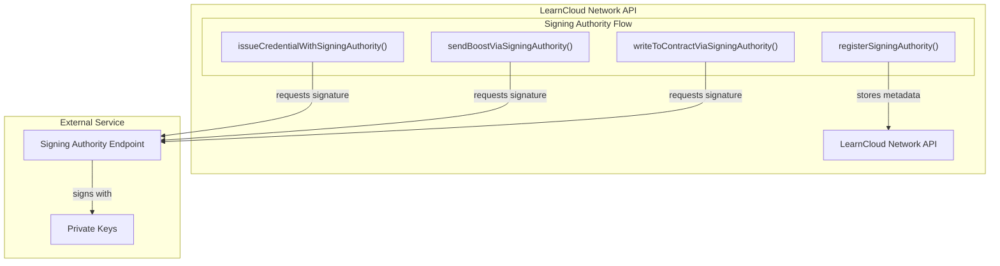

# Signing Authorities

Signing Authorities allow third-party services to issue credentials on behalf of profiles. This enables credential issuance without requiring direct access to private keys.

```mermaid
graph TD
    subgraph "LearnCloud Network API"
        brain["LearnCloud Network API"]

        subgraph "Signing Authority Flow"
            register["registerSigningAuthority()"]
            issue["issueCredentialWithSigningAuthority()"]
            send["sendBoostViaSigningAuthority()"]
            write["writeToContractViaSigningAuthority()"]
        end
    end

    subgraph "External Service"
        endpoint["Signing Authority Endpoint"]
        keys["Private Keys"]
    end

    register -->|"stores metadata"| brain
    issue -->|"requests signature"| endpoint
    send -->|"requests signature"| endpoint
    write -->|"requests signature"| endpoint

    endpoint -->|"signs with"| keys
```

