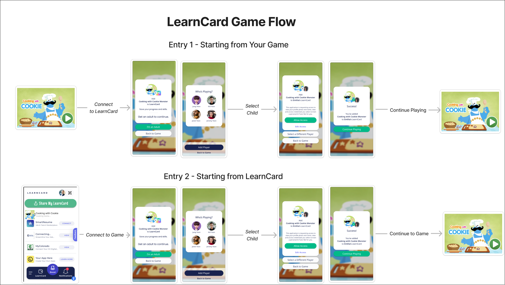

# 🔌 Connect Your Application

## How Connected Applications Work

1. (optional) Apps in the [**Trusted App Registry**](connect-your-application.md#become-a-trusted-application) will be displayed in the LearnCard Launchpad.

.png>)

2. (optional) Users will be redirected to your [connectUrl](connect-your-application.md#connecturl) when they click connect.
3. (optional) Users sign up / login to your application.&#x20;
4. Through a direct link, or a QR code, your application redirects the user to `https://learncard.app/launchpad?connectTo=yourAppProfileId&challenge=aaaa-bbbb-cccc-dddd`
5. The user will be given the option to Accept or Deny the request to connect with your application.


If you are not in the [Trusted App Registry](connect-your-application.md#get-added-to-the-trusted-app-registry), the user will see the "Unknown App Request" prompt:


.png>)

7. If they Accept the connection request, they will be connected with your application and select the credentials that they wish to share with your application.

<figure><figcaption></figcaption></figure>

8. After clicking "Share Credentials" they will be redirected to your [redirectUrl](connect-your-application.md#redirecturl)
9. You now have an active connection with this user and their LearnCard! This enables you to bi-directionally share and send credentials and presentations to each other using the[ LearnCard Network API](https://network.learncard.com/docs) . 🎉

<figure><figcaption><p>Authorize Connected Application Flow</p></figcaption></figure>

## Getting Started

You've decided that you would like to enable your users to connect their LearnCard to your application—that's great! Let's get started.

First, install the **Network Plugin** for LearnCard in your project:



```bash
pnpm i @learncard/init
```



```bash
yarn add @learncard/init
```



```bash
npm i @learncard/init
```



### Add a Network LearnCard to your Application & Create a Service Profile


**There be dragons here.** 🐉&#x20;

In production environments, take great care and caution when generating and storing key material. Insufficient entropy or insecure storage, among other vectors, can easily compromise your data and identities.&#x20;

Refer to [Key Generation](https://docs.learncard.com/learn-card-sdk/learncard-core/construction#key-generation) for more information.


```typescript
// pnpm i @learncard/init
import { initLearnCard } from '@learncard/init';

// Create your LearnCard
const secretSeed = // string of hex characters 0123456789abcdef
const networkLearnCard = await intiLearnCard({ seed: secretSeed, network: true });

// Initialize your profile (one-time only - can also be done using LearnCard CLI)
// Your LearnCard Network account will be discoverable by both your profileId and displayName
const appProfileId = 'yourAppProfileId'; // This value will be used in urls
const appDisplayName = 'App Name Here';
await networkLearnCard.invoke.createServiceProfile({
    profileId: appProfileId,
    displayName: appDisplayName,
});

// Get your DID
const DID = networkLearnCard.id.did();
```

### ConnectUrl

A URL where users will be redirected to when they click the "Connect" button in the LearnCard app

* This URL should link to a co-branded page for your application and LearnCard. You may wish to have users signup for your application here.
* When you're ready, generate an invitation to connect with your application and redirect them back to LearnCard

```typescript
import { initLearnCard } from '@learncard/init';

// using secretSeed and appProfileId from above
const networkLearnCard = await initNetworkLearnCard({ seed: secretSeed, network: true });
const inviteChallenge = await networkLearnCard.invoke.generateInvite();

const redirectUrl = `https://learncard.app/launchpad?connectTo=${encodeURI(profileId)}&challenge=${inviteChallenge.challenge}`

// Redirect
window.location.replace(redirectUrl); // for example
```

### RedirectUrl

A URL where users will be redirected to after they select credentials and click the "Share Credentials" button.

You can then get the verifiable credentials that the user just shared with your application!

```typescript
import { initLearnCard } from '@learncard/init';

// Gets the credentials that the user most recently sent to your application
const getSharedCredentials = async (userProfileId: string) => {
    const networkLearnCard = await initLearnCard({ seed: secretSeed, network: true });

    const sharedCreds = await networkLearnCard.invoke.getIncomingPresentations(userProfileId);
    
    if (sharedCreds.length === 0) return [];
    
    const mostRecentBundle = sharedCreds[0];
    const bundle = await networkLearnCard.invoke.resolveFromLCN(mostRecentBundle.uri);
    const decrypted = await networkLearnCard.invoke.getDIDObject().decryptDagJWE(bundle);
    
    return decrypted.verifiableCredential;
}
```


## ⭐️ Become a Trusted Application


Trusted Applications are in beta! Soon


[**Submit a PR in the LearnCard Registry**](https://github.com/learningeconomy/registries/blob/main/learncard/trusted-app-registry.json) with the following information added:

* Organization info
  * Name
  * Address
* App info
  * Name
  * Short description (\~25 characters)
  * App Icon URL
  * Whether you wish to allow users to edit/update the credentials that they share with you
* URLs
  * Main URL for your application (e.g. `learncard.app`)
  * [connectUrl](connect-your-application.md#connecturl)
  * [redirectUrl](connect-your-application.md#redirecturl)
* LearnCard Network Profile ID
  * This is the string that you specify when creating your [Network LearnCard](connect-your-application.md#a-network-learncard)
* DID Associated with your Application
  * This is the DID associated with your [Network LearnCard](connect-your-application.md#a-network-learncard)
